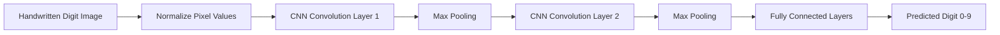

# Workflow / System Diagram

```mermaid
flowchart LR
    A[Handwritten Digit Image] --> B[Normalize Pixel Values]
    B --> C[CNN Convolution Layer 1]
    C --> D[Max Pooling]
    D --> E[CNN Convolution Layer 2]
    E --> F[Max Pooling]
    F --> G[Fully Connected Layers]
    G --> H[Predicted Digit 0-9]
```
